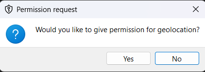
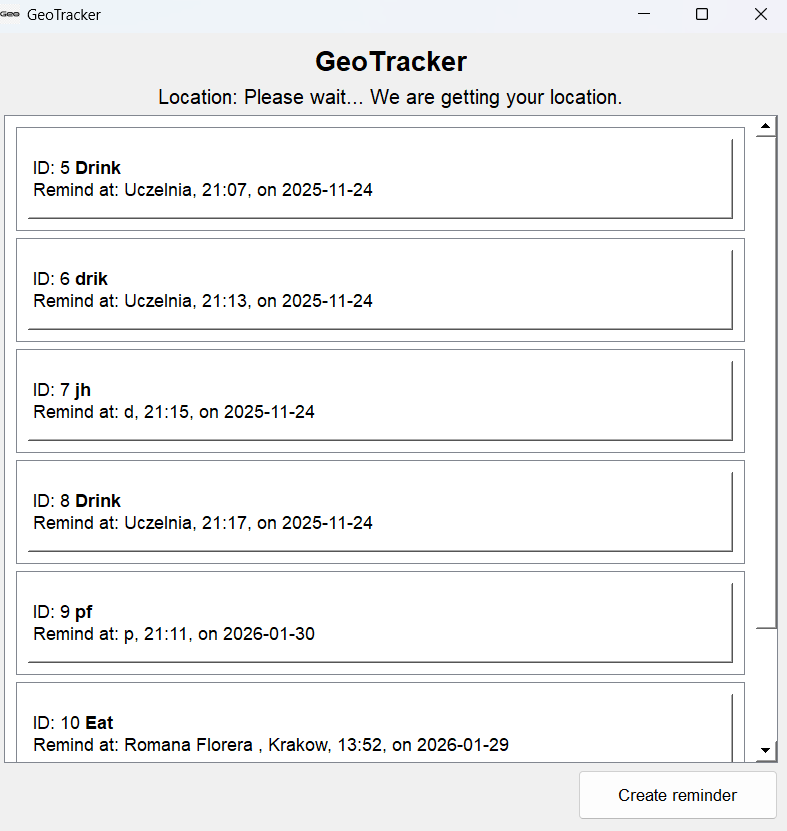
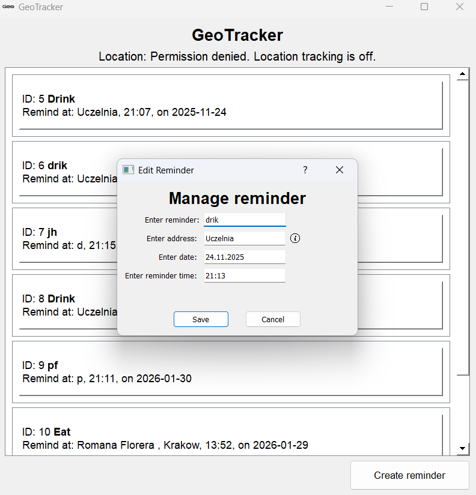
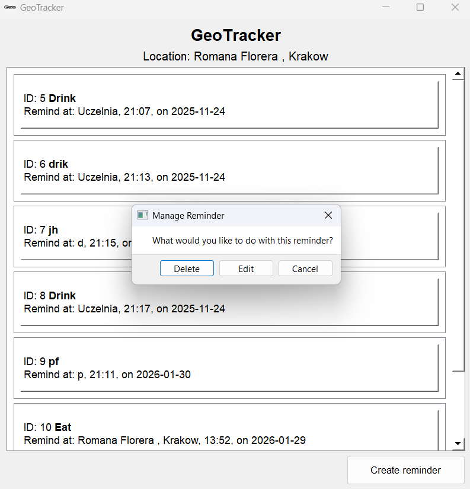

# GeoTracker&Notify

## Intro
GeoTracker&Notify is a desktop application that goes beyond standard to-do lists by triggering reminders based on your real-time geographic location. It combines a robust PyQt5 interface with a background Flask server to handle geolocation data, ensuring you never forget a task when you arrive at a specific destination.

## Technologies and tools used for this project:
- Backend Logic: Python 3.x, Flask (Local Server)
- Frontend: PyQt5 (Desktop GUI)
- Data: SQLite, SQLAlchemy (ORM)
- API: OpenCage Data (Geocoding)
- Concurrency: Python threading module

## Project Structure
```shell
├── alembic/                   # Database migration scripts
├── assets\Icons/              # Static assets (icons/images)
├── Event_manager/             # Core application logic & Backend
│   ├── __init__.py            # Package initialization & exports
│   ├── location_service.py    # Flask server & OpenCage integration
│   ├── manager.py             # Business logic & Thread management
│   ├── notification_logic.py  # Background reminder checker
│   └── reminder_repository.py # Database ORM & CRUD operations
├── GUI/                       # Frontend (PyQt5) components
│   ├── __init__.py            # Package initialization
│   ├── error_dialog.py        # Error popup logic
│   ├── main_window.py         # Main dashboard UI
│   ├── notification.py        # System tray integration
│   ├── permission_dialog.py   # Location permission request
│   └── reminder_dialog.py     # Create/Edit reminder form
├── saved_reminders/           # Directory for local SQLite database
├── templates/                 # Flask HTML templates
│   └── location_request.html
├── .gitignore                 # Git exclusion rules
├── alembic.ini                # Alembic configuration
├── README.md                  # Project documentation
├── requirements.txt           # Python dependencies
└── run.py                     # Application entry point
```
## Features
- Smart Reminders – Define tasks with a title, specific address, date, and time. The system only alerts you if both time and location conditions are met.
- Real-Time Geocoding – Automatically converts raw GPS coordinates (Lat/Lon) into human-readable addresses using the OpenCage API.
- Hybrid Location Tracking – Uses a local Flask server and browser navigation integration to approximate location on desktop devices lacking GPS hardware.
- System Tray Integration – Runs unobtrusively in the background; notifications appear as native system tray alerts.
- Persistent Storage – Reminders are saved locally in a SQLite database, ensuring data survives application restarts.
- Interactive GUI – A custom PyQt interface with scrollable lists, modal dialogs for input, and error handling.

## Setup
You will need valid OpenCage API key.
- Instalation 
1. In terminal or powershell write this:
```shell
pip install -r requirements.txt
```
2. Create a file named .env in the 'Event_manager' folder and add your API key: 
```file
OPENCAGE_API_KEY=your_api_key_here
```
3. You can run this application by command:
```shell
python run.py
```
- Database: The saved_reminders.db file is created automatically in the ./saved_reminders/ folder upon the first run.
- Location Update: The app will automatically open your default web browser to http://127.0.0.1:5000 to request location permissions.

## How to use alembic (database migration tool)

### 1. Generate a Migration Script
After modifying your SQLAlchemy models, run the following command to detect changes and create a version file: 
```shell
alembic revision --autogenerate -m "Describe your change here"
```
### 2. Apply the Changes
To apply the pending migrations to the actual saved_reminders.db database: 
```shell
alembic upgrade head
```
### How to revert changes
If you need to undo the last migration:
```shell
alembic downgrade -1
```
## Current limitations
- Desktop Location Accuracy: Since standard desktops lack GPS chips, this app uses a workaround involving 'webbrowser' navigation to a local server to approximate location via Wi-Fi/IP. Accuracy may vary compared to mobile devices.
- Browser Dependency: The application requires the browser to remain open or be opened periodically to refresh coordinates.
- Tested and developed on Windows.

## Gallery

<p align="center">
  
  
  
  
</p>
